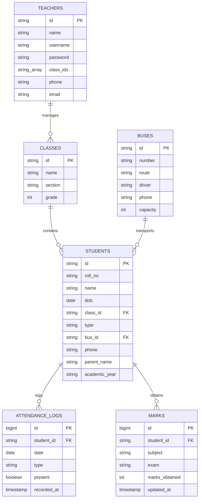
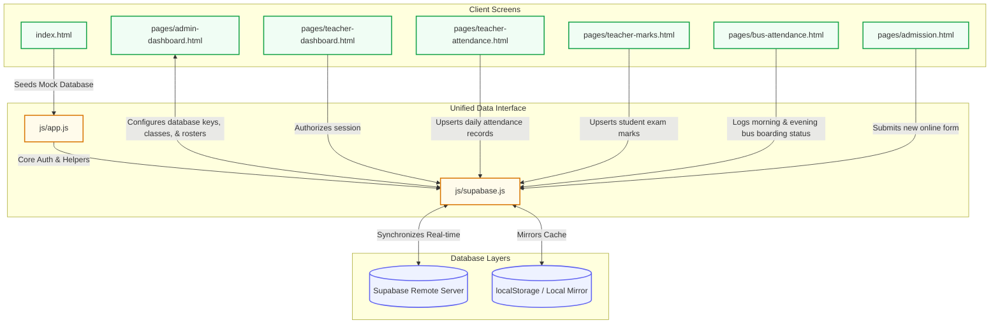

# 🏛️ MSS School Portal – Database Architecture & Sync Flow

Welcome to the database documentation of the **MSS Matriculation School Portal**. This system utilizes a hybrid, offline-first replication system linking local storage to a live Supabase back-end.

---

> [!IMPORTANT]
> **Hybrid Sync Model:** The application operates on an offline-first strategy. All reads and writes initially map to **LocalStorage** (prefixed with `mss_`). If a Supabase connection is established, the application automatically replicates changes to remote PostgreSQL database tables.

---

## 🗺️ Entity Relationship Diagram (ERD)

The relational mappings between school entities:



---

## 💾 LocalStorage Layout (`localStorage`)

Local storage acts as our local database cache. All values are keyed with the `mss_` prefix.

| Key | Description | Type / Blueprint |
| :--- | :--- | :--- |
| 🔑 `mss_seeded` | Initial setup seed status indicator | `Boolean` |
| 📅 `mss_activeAcademicYear` | Configured active school year overrides (e.g. `2025-26`) | `String (YYYY-YY)` |
| 🛡️ `mss_admin` | Principal credentials for root panel access | `{ username, password, name }` |
| 🏫 `mss_classes` | Available grades and classes | `Array<{ id, name, section, grade }>` |
| 👩‍🏫 `mss_teachers` | Roster of teachers with multi-class access | `Array<{ id, name, username, password, classId: string\|string[], phone, email }>` |
| 🎒 `mss_students` | Roster of students with transit details | `Array<{ id, rollNo, name, dob, classId, type: 'bus'\|'dayscholar', busId, phone, parentName }>` |
| 🚌 `mss_buses` | Bus routes, capacity, and driver detail sheets | `Array<{ id, number, route, driver, phone, capacity }>` |
| 📝 `mss_subjects` | School subjects categorized per grade levels | `Object<{ [classId]: string[] }>` |
| 📅 `mss_attendanceLogs` | Class and bus attendance records | `Array<{ studentId, date, type: 'class'\|'bus-morning'\|'bus-evening', present }>` |
| 📊 `mss_marks` | Student academic grades for subject exams | `Object<{ [studentId]: { [subject]: { [exam]: number } } }>` |
| 📩 `mss_admissions` | Online admission forms waiting for admin check | `Array<{ id, student_name, dob, gender, status: 'pending'\|'approved' }>` |

---

## 🗄️ Remote PostgreSQL Database Schemas (Supabase)

To enable live synchronization, execute these SQL statements in your Supabase SQL editor:

```sql
-- 1. Class Schema
CREATE TABLE IF NOT EXISTS classes (
  id TEXT PRIMARY KEY,
  name TEXT NOT NULL,
  section TEXT,
  grade INTEGER
);

-- 2. Transit Schema
CREATE TABLE IF NOT EXISTS buses (
  id TEXT PRIMARY KEY,
  number TEXT NOT NULL,
  route TEXT,
  driver TEXT,
  phone TEXT,
  capacity INTEGER DEFAULT 40,
  created_at TIMESTAMPTZ DEFAULT now()
);

-- 3. Student Schema
CREATE TABLE IF NOT EXISTS students (
  id TEXT PRIMARY KEY,
  roll_no TEXT NOT NULL,
  name TEXT NOT NULL,
  dob DATE,
  class_id TEXT REFERENCES classes(id) ON DELETE SET NULL,
  type TEXT DEFAULT 'dayscholar',
  bus_id TEXT REFERENCES buses(id) ON DELETE SET NULL,
  phone TEXT,
  parent_name TEXT,
  academic_year TEXT,
  created_at TIMESTAMPTZ DEFAULT now()
);

-- 4. Teacher Schema
CREATE TABLE IF NOT EXISTS teachers (
  id TEXT PRIMARY KEY,
  name TEXT NOT NULL,
  username TEXT UNIQUE NOT NULL,
  password TEXT NOT NULL,
  class_id TEXT, -- Stores class ID or serialized class IDs array matching local classId
  phone TEXT,
  email TEXT,
  created_at TIMESTAMPTZ DEFAULT now()
);

-- 5. Attendance Log Schema
CREATE TABLE IF NOT EXISTS attendance_logs (
  id BIGSERIAL PRIMARY KEY,
  student_id TEXT REFERENCES students(id) ON DELETE CASCADE,
  date DATE NOT NULL,
  type TEXT NOT NULL, -- 'class' | 'bus-morning' | 'bus-evening'
  present BOOLEAN DEFAULT false,
  recorded_at TIMESTAMPTZ DEFAULT now(),
  UNIQUE(student_id, date, type)
);

-- 6. Exam Marks Schema
CREATE TABLE IF NOT EXISTS marks (
  id BIGSERIAL PRIMARY KEY,
  student_id TEXT REFERENCES students(id) ON DELETE CASCADE,
  subject TEXT NOT NULL,
  exam TEXT NOT NULL, -- 'exam1' | 'exam2' | 'exam3'
  marks_obtained INTEGER,
  updated_at TIMESTAMPTZ DEFAULT now(),
  UNIQUE(student_id, subject, exam)
);

-- 7. Admission Application Schema
CREATE TABLE IF NOT EXISTS admission_applications (
  id BIGSERIAL PRIMARY KEY,
  student_name TEXT,
  dob DATE,
  gender TEXT,
  applying_class TEXT,
  nationality TEXT,
  religion TEXT,
  father_name TEXT,
  mother_name TEXT,
  phone TEXT,
  email TEXT,
  address TEXT,
  father_occupation TEXT,
  annual_income TEXT,
  prev_school TEXT,
  last_class TEXT,
  transport TEXT,
  notes TEXT,
  status TEXT DEFAULT 'pending',
  submitted_at TIMESTAMPTZ DEFAULT now()
);
```

---

## ⚡ Data Flow & File Sync Diagram

The diagram below maps how each frontend file connects to the local and remote databases:



---

> [!TIP]
> **Checking Synchronization Status:** To view connection details, open the **Admin Dashboard** and check the Database Settings block. Real-time updates occur via the custom event `mss-db-sync`.
