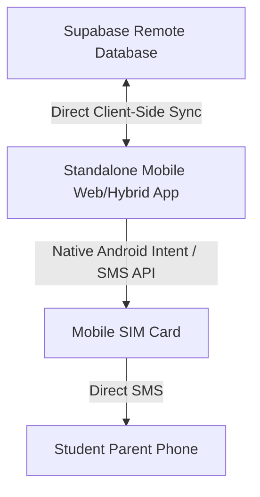

# Standalone Bulk SMS Android Client App Specification for Google AI Studio

This specification provides the architecture, database mappings, and implementation guidelines for a standalone mobile/web application (built without any server-side Node.js/API intermediary) that reads student fee data directly from the Supabase database and triggers bulk SMS dispatch using the mobile device's native SIM card.

---

## 1. Core Architecture



- **Runtime Environment**: Standalone HTML5/JavaScript application packaged using Apache Cordova, Capacitor, or run directly within an Android WebView.
- **Backend Intermediary**: None. All database read/write actions are performed client-side using `@supabase/supabase-js`.
- **Hardware Integration**: Uses the mobile device's local SIM card to send text messages.

---

## 2. Supabase Database Schema Integration

The app connects directly to the school's Supabase instance. Two tables are queried to build the SMS recipient list:

### Table 1: `students`
This table holds student details, academic year tracking, and parent contact phone numbers.

| Column | Type | Description |
| :--- | :--- | :--- |
| `id` | `TEXT` | Primary key representing student ID |
| `name` | `TEXT` | Student name |
| `phone` | `TEXT` | Parent contact phone number (e.g., `+919876543210`) |
| `academic_year` | `TEXT` | Current academic year (e.g., `2026-2027`) |

### Table 2: `student_fees`
This table stores the financial cards for students.

| Column | Type | Description |
| :--- | :--- | :--- |
| `student_id` | `TEXT` | Foreign key referencing `students.id` |
| `academic_year` | `TEXT` | Current academic year (e.g., `2026-2027`) |
| `total_due` | `INTEGER` | Sum of all yearly fees, bus fees, book fees, uniform fees, and custom fees, minus any concession. |
| `total_paid` | `INTEGER` | Total amount paid by student for the active academic year |

---

## 3. Data Sync Algorithm (Client-Side Query)

To retrieve a list of students with outstanding balances, execute the following SQL-equivalent query via the Supabase client:

```javascript
// Initialize Supabase Client
const supabase = supabase.createClient(SUPABASE_URL, SUPABASE_ANON_KEY);

async function syncPendingFeeStudents(activeYear) {
  // Query all students for active year
  const { data: students, error: sErr } = await supabase
    .from('students')
    .select('id, name, phone')
    .eq('academic_year', activeYear);

  if (sErr) throw sErr;

  // Query fee records
  const { data: fees, error: fErr } = await supabase
    .from('student_fees')
    .select('student_id, total_due, total_paid')
    .eq('academic_year', activeYear);

  if (fErr) throw fErr;

  // Combine and calculate balance outstanding
  const recipientList = [];
  students.forEach(s => {
    const feeCard = fees.find(f => f.student_id === s.id);
    if (feeCard) {
      const due = Number(feeCard.total_due) || 0;
      const paid = Number(feeCard.total_paid) || 0;
      const balance = due - paid;

      // Only include students with active phone numbers and pending balances
      if (balance > 0 && s.phone) {
        recipientList.push({
          studentId: s.id,
          name: s.name,
          phone: s.phone.trim(),
          balance: balance
        });
      }
    }
  });

  return recipientList;
}
```

---

## 4. Mobile SMS Dispatch Mechanisms

To send messages using the phone's SIM card without external paid APIs, use one of the following client-side methods:

### Method A: Direct SMS (Hybrid App/WebView Wrapper)
If packaging the app with **Cordova/Capacitor**, install the native SMS plugin:
`cordova-plugin-sms-json` or `@awesome-cordova-plugins/sms`.

```javascript
// direct background SMS send via SIM (requires SEND_SMS permission in AndroidManifest.xml)
function sendDirectSMS(phoneNumber, message) {
  return new Promise((resolve, reject) => {
    if (window.sms) {
      window.sms.send(phoneNumber, message, {
        replaceLineEndings: true,
        android: {
          intent: '' // Send directly in background without opening default SMS app
        }
      }, () => {
        resolve(true);
      }, (err) => {
        reject(err);
      });
    } else {
      reject("SMS plugin not loaded or not running on a mobile device.");
    }
  });
}
```

### Method B: SMS App Intent Fallback (Mobile Browser)
If running directly in the browser, trigger the device's system SMS app with pre-filled content:

```javascript
function openSmsIntent(phoneNumber, message) {
  const url = `sms:${phoneNumber}?body=${encodeURIComponent(message)}`;
  window.open(url, '_blank');
}
```

---

## 5. UI Layout Guidelines (Google AI Studio Prompts)

Generate a single-page HTML interface containing the following sections:
1. **Supabase Configuration Panel**: Allow the admin to enter their `SUPABASE_URL` and `SUPABASE_ANON_KEY` (persisted securely in local storage).
2. **Academic Year Selector**: Input/dropdown for target academic year (e.g., `2026-2027`).
3. **SMS Custom Template Editor**:
   - Provide placeholders: `{name}` for student name and `{balance}` for outstanding balance.
   - Example Template: `Dear Parent, please pay the pending school fee of ₹{balance} for {name}. Thank you.`
4. **Interactive Recipient Grid**:
   - Display columns: Student Name, Parent Phone, Balance Outstanding, Status (`Pending`, `Sending`, `Sent`, `Failed`).
   - Checkboxes next to each row to select/deselect individual recipients.
5. **Bulk Send Action Bar**:
   - A prominent **"Sync Pending Fees"** button to load the latest numbers and balances from Supabase.
   - A **"Send Bulk SMS"** button to initiate sequential dispatch.
6. **Progress Tracker Component**:
   - Visual progress bar showing percentage completion (e.g., `Sent: 12 / 120`).
   - Log panel detailing current sending operations.

---

## 6. Sync Log Write-back to Supabase

After each SMS is successfully dispatched, log the action in the remote database log table `fee_logs` to maintain audits.

```javascript
async function logSmsDispatch(studentName, phone, amount) {
  const logEntry = {
    id: 'fl-' + Math.random().toString(36).substr(2, 9),
    action: 'SMS Reminder Sent',
    details: `Sent outstanding fee reminder of ₹${amount} to ${studentName} (${phone})`,
    user_id: 'sms-app-client',
    user_name: 'Mobile SMS Dispatcher',
    created_at: new Date().toISOString()
  };

  const { error } = await supabase
    .from('fee_logs')
    .insert([logEntry]);
    
  if (error) console.error("Failed to write sync log:", error);
}
```
